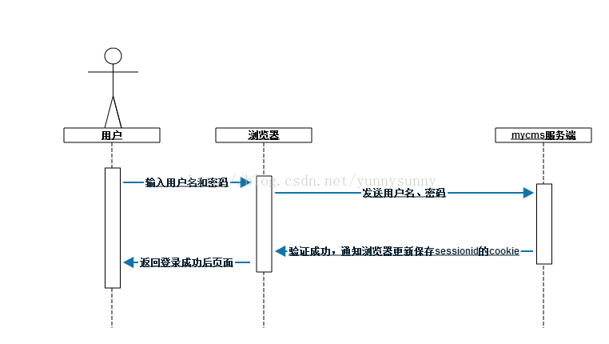

## 开局只有四行代码
```js
http.createServer(function(req, res) {
  res.writeHead(200, {'Content-Type': 'text/plain'});
  res.end('Hello World');
}).listen(1337, '127.0.0.1')
```
## 请求方法判断
restful类的web服务，请求方法决定资源的操作行为，PUT->新建，POST->更新，GET->查看，DELETE->删除
什么是restful https://juejin.im/entry/59f5f8cbf265da4327177e08
用一个买咖啡的例子进行描述
level0:面向前台，将所有操作及操作内容都通过统一的入口去处理
level1:面向资源，将所有操作需要更改的资源进行分类，不同类别的资源有各自的增删改查操作，所有的处理都直接面向资源
level2:面向操作，对相应资源的操作进行分类，所有请求都先分好操作类型，PUT->新建，POST->更新，GET->查看，DELETE->删除，一个行为对应一种控制器
level3:完美服务，
## 路径解析
- 位置：报文第一行,http_parse将其解析为req.url,
- hash不被存放
- 可以通过路径解析来选择控制器 /controller/action/p1/p2/p3
## 查询字符串
- 请求 /path?a=1&b=2
- 接受 req.query = { a: 1, b: 2 }
- 实现
```js
const url = require('url');
function (req, res) {
  req.query = url.parse(req.url, true).query; hande(req, res);
}
```
## cookie
- cookie存放位置：HTTP_Parser会将所有的报文字段解析到req.headers上
- 为什么需要cookie（理解http无状态协议）
    - 为什么设计成无状态协议：历史原因，设计之初，网站仅用于网页的浏览，不需要记录用户的请求状态，
    每次用户进入，都显示同样的内容
    - 如今的web应用，请求之间联系相关大，为什么不重新设计成有状态协议：内存开销大，所有用户的请求都需要在
    http层记录，基于历史已有方式，通过cookie和session来兼容
- 应用场景：当用户首次进入，告知用户是首次进入，当用户再次进入，不需要再次提示
- 如何通过cookie进行状态记录：服务器向客户端发送cookie，浏览器保存cookie，每次请求带上cookie
- 服务器解析客户端 cookieSet-Cookie: name=value; Path=/; Expires=Sun, 23-Apr-23 09:01:35 GMT; Domain=.domain.com;
```js
var parseCookie = function (cookie) {
  var cookies = {};
  if (!cookie) {
    return cookies;
  }
  var list = cookie.split(';');
  for (var i = 0; i < list.length; i++) {
    var pair = list[i].split('=');
    cookies[pair[0].trim()] = pair[1];
  }
  return cookies;
};
```
    中间件将其解析后存放在req.cookies上
- 服务端如何将cookie写到响应头
## session
- 为什么需要session:cookie是可以前端进行访问和改写的，需要将重要的数据放在服务端进行保存，cookie只保存索引，通过索引从服务端获取数据
- 什么是session:是在服务端保存的一个数据结构，用来跟踪用户的状态
- 原理解析：如何用session保存用户登录状态

- session的在node的实现
    - session最终的数据格式
    ```json
    {  
      "id1": {
        "expires": "xxxx",
        "data": {}
      },
      "id2": {
        "expires": "xxxx",
         "data": {}
      }
    }
    ```
    - 生成sessionId
    ```js
    var sessions = {};
    var key = 'session_id';
    var EXPIRES = 20 * 60 * 1000;
    var generate = function() {  
      var session = {};
      var id = (new Date()).getTime() + Math.random();
      session = {
        expires: (new Date()).getTime() + EXPIRES;
      };
      sessions[id] = session;  
      return session;
    }
    ```
    - cookie口令校验及session生成
    ```js
    function (req, res) {
      const id = req.cookie["session_id"];
    
      if(id) {
        const session = sessions[id];
        if(session.cookie.expire > (new Date()).getTime()) {//未超时
          // 更新过期时间
          session.cookie.expire = (new Date()).getTime() + EXPIRE_TIME;
          // 设置session
          res.session = session;
        }else {// 超时
          delete sessions[id];
          res.session = session;
        }
      }else {
        res.session = generate();
      }
      handle(req, res);
    }
    ```
    - 根据cookie获取用户状态并返回相应值
    ```js
    var handle = function (req, res) { 
      if (!req.session.isVisit) {
        res.session.isVisit = true; 
        res.writeHead(200); res.end('欢迎第一次来到动物园');
      } else {
        res.writeHead(200); res.end('动物园再次欢迎你');
      }  
    };
    ```
- session与内存
    - 避免内存泄露，以及控制内存
    - 多进程之间的数据保存：统一的数据存储redis
- session安全：通过私钥对sessionId进行加密，避免id伪造，造成身份伪造
## xss（跨站脚本攻击）攻击
- 原理：通过在第三方网站执行注入的脚本，盗取用户的session口令，进而伪造用户身份

## csrf（跨站点请求伪造）攻击原理及防范措施
### 攻击原理
受攻击网站某银行网站a,在用户tom提交转账时的接口为a.example.com/?from=tom&count=100,
用户登录该网站时，登录信息会保存到cookie中，攻击者b建了一个网站b.example.com网站b，
有一个诱导链接<a href="a.example.com/?from=tom&count=100&to=b"></a>,此时用户tom在未退出登录的情形下，
去点击该链接，此时服务端会成功验证登录状态并成功转账到b。
### 防范措施
- http referrer：http请求头中会有一个referer字段，用于记录请求的来源，服务端通过判断请求来源是否为a.example.com
来避免攻击，但是referer在很多浏览器中可以被篡改
- token：服务端生成一个随机token，前端所有的请求中都带上这个token，每次校验该token是否与服务端保持一致来避免攻击
### 该注意什么
- token不要存在本地的任何地方，攻击这个可能会通过xss获取token，再通过csrf来进行攻击
### 相关链接
- CSRF 攻击的应对之道：https://www.ibm.com/developerworks/cn/web/1102_niugang_csrf/index.html
- 浅谈CSRF攻击方式：https://www.cnblogs.com/hyddd/archive/2009/04/09/1432744.html

## 缓存
### 四种常用的缓存机制
- If-Modified-since:根据文件最终修改事件进行缓存
    - 文件时间戳改动，但内容不一定改动
    - 只能精确到秒级
- Etag:根据文件内容生成散列值
- Expires:设置文件过期时间，该期间内都会从浏览器拿缓存文件，不会请求服务端
    - 可能出现服务端时间和浏览器时间不一致的情况
- Cache-Control:设置文件过期时长
前两种都需要发动请求到服务端，后两种直接从浏览器获取缓存文件效率更高
### 清除缓存
通过给资源链接加版本号，可以直接获取最新资源

## 路由映射
### 手工映射
- 原理：use(pathRegExp, controller)，将路由信息和控制器写入配置文件形成关联，请求进入时通过
解析路径，执行相应的控制器。
- 参数：/path1/path2/:param形式的路径解析，访问路径形如path1/path2/xxx时，将xxx通过正则获取，赋值到
req.params.param上，作为后续控制器调用时的参数

### 自动映射
- 原理：约定一个固定的路由格式：/controller/action/param1/param2/param3，按约定找controller目录下的user
文件，将其require出来后调用action，其余作为参数传入

### Restful
- 作用：在路由中体现对资源的操作
- 实现：在路由映射中包含请求操作的条件，同一路由如果请求方法不同，将可能调用不同的控制器

## 页面渲染

### 内容响应
- mime:响应头中content-type会包含mime信息，该信息用于标志返回文件的类型，客户端根据不同类型，执行不同的操作
application/json->json,application/xml->xml
- 附件下载：直接下载文件，Content-Disposition: attachment; filename="filename.ext"参照页面服务长图导出功能
- 响应json：ajax请求
- 响应跳转：网站重定向

### 如何实现一个模板引擎
- 正则匹配，返回替换模板变量后的模板
- 创建函数，将变量输出为值，得到最终模板
- 转义和渲染逻辑的支持
- 渲染性能相关：模板首次转义后存入缓存

### bigpipe渲染实现原理
- 输出骨架：包含两部分，第一部分是包含bigpipe资源的html骨架文件，第二部分是bigpipe渲染事件订阅的scipt脚本
- 输出渲染脚本：当后端处理完数据请求时，将数据作为事件参数，输出的渲染脚本中是一个触发渲染事件的方法
- bigpipe是什么：内核是一个事件发布订阅的模块，结合服务端的分段输出，在返回数据时候触发带数据的渲染
- bigpipe解决什么问题：对于需要一次性请求超大数据量的页面，通过分段输出的方式，先进行骨架的渲染，再进行数据内容的填充


