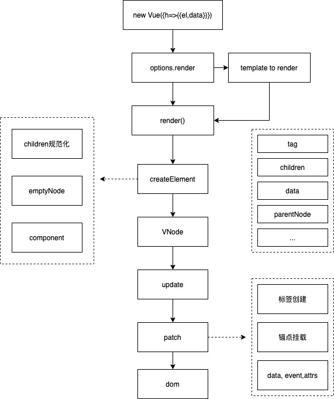
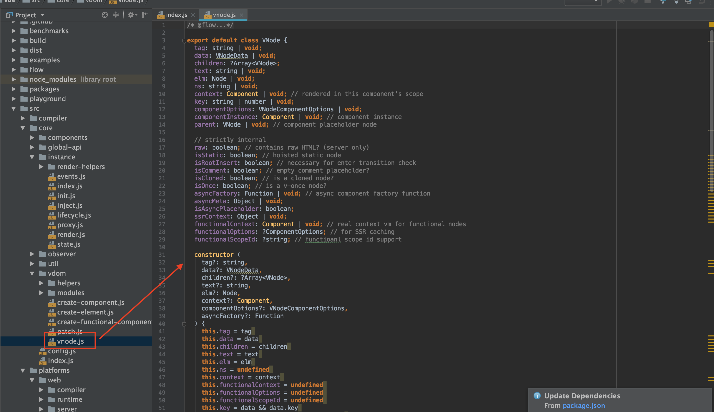
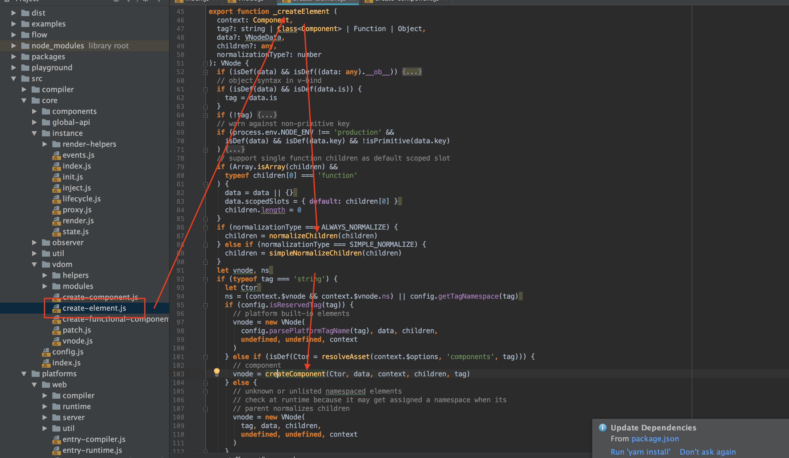

## 数据驱动

### 理解

本质上时将 new Vue({render: (h) => h(tag, data)})中的render通过一系列转化生成最终的dom，数据驱动的核心有两个
 * 将dom和data分离，开发者只需要关注data的变化，而不需要关心dom操作
 * 通过js对象（vnode）对完整dom进行了描述，以减少因为dom文件描述巨大带来更新时的性能损耗
 
#### 跟模板语言的区别

* 传统开发方式从jquery框架直接操作演变到通过模板渲染引擎（juicer，jade）去操作更新，本质上也能够实现数据驱动，但是这里存在的问题是无论是什么粒度的数据更新都会去全量更新dom树，性能损耗巨大，控制粒度只能够依赖开发者自觉，而vue基于vnode的patch可以保证这种更新操作的下限，控制重绘的开销。
 
### 执行过程

#### 主要流程
 

* 判断是否已声明render函数，由于vue组件支持template，这个类型的组件不会声明render函数，此时会先将template转化成具体函数（这里应该包含template->ast->vnode阶段）

* createElement: 将传入的组件和data转化成vnode,vnode是一个对象，实现了对dom的完整描述
* update: update会在初始化和数据更新时被执行，核心是将vnode转化成dom并挂载

vue在实际创建dom主要经历2个阶段，createElement生成vnode，patch通过vnode挂载具体的dom，首先对vnode作介绍

#### vnode

 

vnode属性非常庞大，但主要核心只需要关注tag(组件或dom标签)，parent(父节点)，children（子节点）,data（数据），raw（是原生html标签吗）要实现一个基本的vnode几个属性已经完全足够

#### createElement

##### 什么是createElement
可以先看官方对createElement的api介绍

```js
createElement(
  // {String | Object | Function}
  // 一个 HTML 标签名、组件选项对象，或者
  // resolve 了上述任何一种的一个 async 函数。必填项。
  'div',

  // {Object}
  // 一个与模板中 attribute 对应的数据对象。可选。
  {
   'class': {
    foo: true,
    bar: false
    },
      // 与 `v-bind:style` 的 API 相同，
      // 接受一个字符串、对象，或对象组成的数组
      style: {
        color: 'red',
        fontSize: '14px'
      },
      // 普通的 HTML attribute
      attrs: {
        id: 'foo'
      },
  },

  // {String | Array}
  // 子级虚拟节点 (VNodes)，由 `createElement()` 构建而成，
  // 也可以使用字符串来生成“文本虚拟节点”。可选。
  [
    '先写一些文字',
    createElement('h1', '一则头条'),
    createElement(MyComponent, {
      props: {
        someProp: 'foobar'
      }
    })
  ]
)
```
这个基本的createElement使用，但是会有几个特殊的case

* case1: 子组件是标签

``` js
createElement('p', 'hi')
```

* case2: 子组件是数组

```
return createElement('ul', this.items.map(function (item) {
      return [createElement('li', item.name)]
    }))
```

##### createElement做了什么
createElement有三个核心的入参，tag，data，children，通过这三个入参，实例化后返回vnode

 

核心三个流程
* normalizeChildren：children规范化，是针对上述两个特殊case的处理
* html标签：直接生成VNode
* 组件：createComponent->VNode

#### update

通过createElement创建vnode后，update阶段通过识别vnode执行真正的组件挂载，核心包含三个部分
* 寻找锚点（父节点
* 标签生成：props，event，attrs内容合成
* 挂载

### 问题

* 遍历执行createElement过程
* 标签属性，事件生成过程
* 差量更新原理


