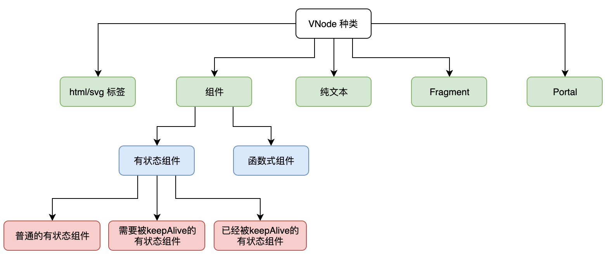

http://hcysun.me/vue-design/zh/h.html#%E4%BD%BF%E7%94%A8-h-%E5%87%BD%E6%95%B0%E5%88%9B%E5%BB%BA-vnode

组件的本质
- 定义：区别与之前模板渲染引擎组件封装，不是一端具体html而是一个个virtual-dom
- vitual-dom渲染：标签挂载和组件渲染，通过递归实现生成vnode
- 组件种类：有状态组件，函数式组件？？（定义是什么）

vnode
- 描述内容：标签，内容，子节点
- 标签种类：组件，html，文本节点，potal,fragment
- 
 

- 性能优化：使用位计算进行标签判断
