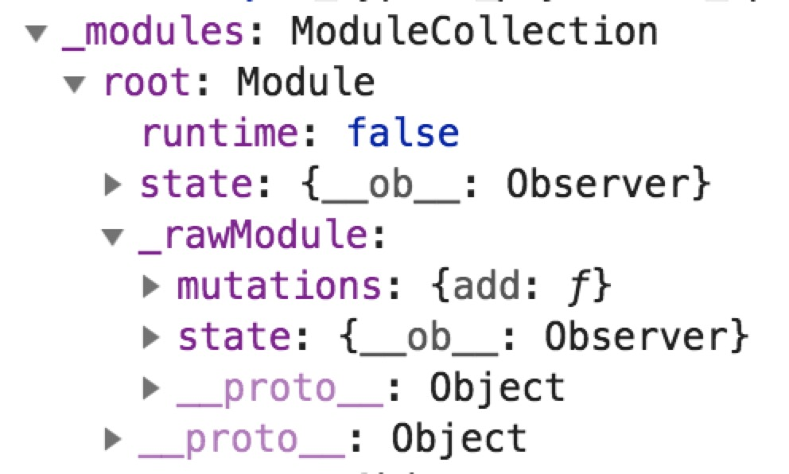
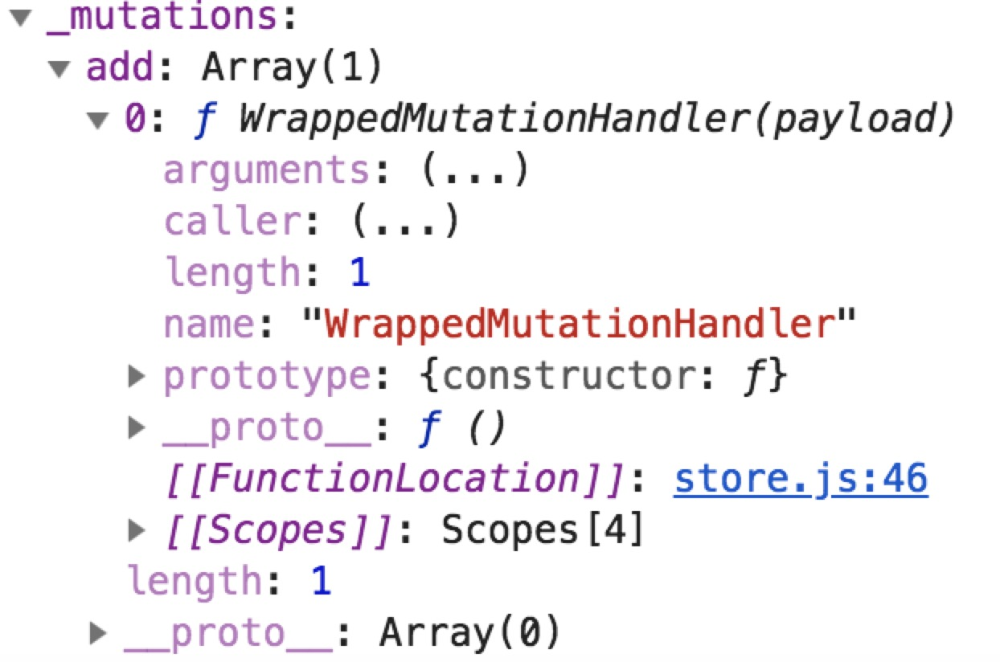
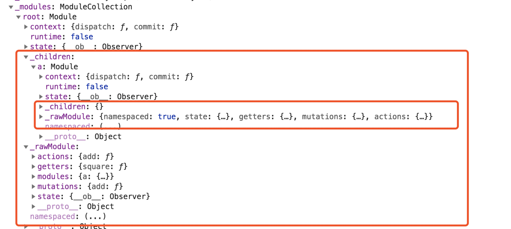

# vuex源码分析
## 了解vuex
### 什么是vuex
 
vuex是一个为vue进行统一状态管理的状态管理器，主要分为state, getters, mutations, actions几个部分，
vue组件基于state进行渲染，当state发生变化时触发组件的重新渲染，并利用了vue的响应式原理，衍生出getters,
getters以state作为基础，进行不同形式的数据的构造，当state发生改变时，响应式的进行改变。state的
改变只能够由commit进行触发，每次的改变都会被devtools记录。异步的操作通过actions触发，比如后台api请求发送等，
等异步操作完成时，获取值并触发mutations事件，进而实现state重新求值，触发视图重新渲染。

### 为什么需要vuex
- 解决组件间的通信和传统事件模式过长的调用链难以调试的问题，在vue的使用中，我们利用vue提供的事件模式实现父子间的通信，或者利用eventBus的方式进行多组件
之间的通行，但是随着项目变得庞大，调用链有时会变的很长，会无法定位到事件的发起者，并且基于事件模式的调试是会让开发者
头疼不已，下一个接手项目的人很难知道一个事件的触发会带来哪些影响，vuex将状态层和视图层进行抽离，所有的状态得到统一的管理
所有的组件共享一个state，有了vuex我们的关注从事件转移到了数据，我们可以只关心哪些组件引用了状态中的某个值，devtools实时反应
state的当前状态，让调试变得简单。另外组件间的通信，从订阅同一个事件，转移到了共享同一个数据，变得更加简易。
- 解决父子组件间数据传递问题，在vue的开发中我们会通过props或者inject去实现父子组件的数据传递，但是当组件层级过深时
props的传递会带来增加冗余代码的问题，中间一些不需特定数据的组件为了进行数据传递会注入不必要的数据，而inject的数据传递本来就是有缺陷的
当代码充斥着各种provided和inject时，杂乱的根本不知道组件inject的数据是在哪里provide进来的。vuex将一些公用数据抽离并统一管理后，直接让这种复杂的数据传递变得毫不费力。
## 一 install
为了实现通过Vue.use()方法引入vuex，需要为vuex定义一个install方法。vuex中的intall方法主要作用是将store实例注入到每一个vue组件中，具体实现方式如下
```js
export function install (_Vue) {
  // 避免重复安装
  if (Vue && Vue === _Vue) {
    // 开发环境报错
    console.warn("duplicate install");
  }
  Vue = _Vue;
  // 开始注册全局mixin
  applyMixin(Vue);
}
```
以上代码中通过定义一个全局变量Vue保存当前的引入的Vue来避免重复安装，然后通过apllyMixin实现将store注入到各个实例中去
```js
export default function (Vue) {
  // 获取vue版本
  const version = Number(Vue.version.split(".")[0]);

  // 根据版本选择注册方式
  if (version >= 2) {
    // 版本大于2在mixin中执行初始化函数
    Vue.mixin({ beforeCreate: vuexInit });
  } else {
    // 低版本，将初始化方法放在options.init中执行
    const _init = Vue.prototype._init;

    Vue.prototype._init = function (options = {}) {
      options.init = options.init
        ? [vuexInit].concat(options.init)
        : vuexInit;
      _init();
    };
  }

  // 初始化函数:将store作为属性注入到所有组件中
  function vuexInit () {
    // 根组件
    if (this.$options && this.$options.store) {
      this.$store = typeof this.$options.store === "function"
        ? this.$options.store()
        : this.$options.store;
    } else if (this.$options.parent && this.$options.parent.$store) { // 非根组件
      this.$store = this.$options.parent.$store;
    }
  }
}
```
首先看这段代码核心逻辑实现的关键函数vuexInit，该函数首先判断this.$options选项（该选项在根实例实例化时传入new Vue(options:Object)）
```js
new Vue({
  store
})
```
中是否包含store属性，如果有，则将实例的this.$store属性指向this.$options.store,如果没有则指向this.$parent即父实例中的$store。
此时我们在install执行后，通过在实例化根组件时把store传入options就能将所有子组件的$store属性都指向这个store了。
此外需要注意的时applyMixin执行时首先会判断当前Vue的版本号，版本2以上通过mixin混入的方式在所有组件实例化的时候执行vueInit，而
版本2以下则通过options.init中插入执行的方式注入。以下时安装函数的几点总结
- 避免重复安装
- 判断版本，不同版本用不同方式注入初始方法，2之前通过options.init注入，2之后通过mixin注入
- 将store注入到所有vue的实例属性$store中

## 二、如何实现一个简单的commit
commit实际上就是一个比较简单的发布-订阅模式的实现，不过这个过程中会涉及module的实现，state与getters之间响应式的实现方式，并为之后介绍actions可以做一些铺垫
### 使用
首先回顾下commit的使用
```js
// 实例化store
const store = new Vuex.Store({
  state: { count: 1 },
  mutations: {
    add (state, number) {
      state.count += number;
    }
  }
}); 
```
实例化store时，参数中的mutation就是事件队列中的事件，每个事件传入两个参数，分别时state和payload,每个事件实现的都是根据payload改变state的值
```vue
<template>
    <div>
        count:{{state.count}}
        <button @click="add">add</button>
    </div>
</template>

<script>
  export default {
    name: "app",
    created () {
      console.log(this);
    },
    computed: {
      state () {
        return this.$store.state;
      }
    },
    methods: {
      add () {
        this.$store.commit("add", 2);
      }
    }
  };
</script>

<style scoped>

</style>
``` 
我们在组件中通过commit触发相应类型的mutation并传入一个payload，此时state会实时发生变化

### 实现
首先来看为了实现commit我们在构造函数中需要做些什么
```js
export class Store {
  constructor (options = {}) {
    // 声明属性
    this._mutations = Object.create(null);
    this._modules = new ModuleCollection(options);
    // 声明发布函数
    const store = this;
    const { commit } = this;
    this.commit = function (_type, _payload, _options) {
      commit.call(store, _type, _payload, _options);
    };
    const state = this._modules.root.state;
    // 安装根模块
    this.installModule(this, state, [], this._modules.root);
    // 注册数据相应功能的实例
    this.resetStoreVm(this, state);
  }
```
首先是三个实例属性_mutations是发布订阅模式中的事件队列，_modules属性用来封装传入的options:{state, getters, mutations, actions}
为其提供一些基础的操作方法，commit方法用来触发事件队列中相应的事件；然后我们会在installModule
中注册事件队列，在resetStoreVm中实现一个响应式的state。

#### modules
在实例化store时我们会传入一个对象参数，这里面包含state,mutations,actions,getters,modules等数据项我们需要对这些数据项进行封装，并暴露一个这个些数据项的操作方法，这就是Module类的作用，另外在vuex中有模块的划分，需要对这些modules进行管理，由此衍生出了ModuleCollection类，本节先专注于commit的实现对于模块划分会放在后面讨论，对于直接传入的state，mutations，actions，getters，在vuex中会先通过Module类进行包装，然后注册在ModuleCollection的root属性中
```js
export default class Module {
  constructor (rawModule, runtime) {
    const rawState = rawModule.state;

    this.runtime = runtime;// 1.todo:runtime的作用是啥
    this._rawModule = rawModule;
    this.state = typeof rawState === "function" ? rawState() : rawState;
  }

  // 遍历mumation,执行函数
  forEachMutation (fn) {
    if (this._rawModule.mutations) {
      forEachValue(this._rawModule.mutations, fn);
    }
  }
}
export function forEachValue (obj, fn) {
  Object.keys(obj).forEach((key) => fn(obj[key], key));
}
```
构造函数中传入的参数rawModule就是{state，mutations，actions，getters}对象,在Module类中定义两个属性_rawModule用于存放传入的rawModule,forEachMutation实现mutations的遍历执行，将mutation对象的value,key传入fn并执行，接下去将这个module挂在modulecollection的root属性上
```js
export default class ModuleCollection {
  constructor (rawRootModule) {
    // 注册根module，入参：path,module,runtime
    this.register([], rawRootModule, false);
  }

  // 1.todo runtime的作用？
  register (path, rawRootModule, runtime) {
    const module = new Module(rawRootModule, runtime);

    this.root = module;
  }
}
```
经过这样一系列的封装，this._modules属性就是下面这样的数据结构<br>
 

### state
由于mutations中保存的所有事件都是为了按一定规则改变state，所以我们要先介绍下store是如何进行state的管理的
尤其是如何通过state的改变响应式的改变getters中的值，在构造函数中提到过一个方法resetStoreVm，在这个函数中
会实现state和getters的响应式关系
```js
  resetStoreVm (store, state) {
    const oldVm = store._vm;
    // 注册
    store._vm = new Vue({
      data: {
        $$state: state
      }
    });
    // 注销旧实例
    if (oldVm) {
      Vue.nextTick(() => {
        oldVm.destroy();
      });
    }
  }
```
这个函数传入两个参数，分别为实例本身和state，首先注册一个vue实例保存在store实例属性_vm上，其中data数据项中定义了$$state属性指向state，后面会介绍将getters分解并放在computed数据项中这样很好的利用Vue原有的数据响应系统实现响应式的state，并且赋新值之后会把老的实例注销。<br>
对于state的包装实际还差一步，我们平常访问state的时候是直接通过store.state访问的，如果不做处理现在我们只能通过store._vm.data.$$state来访问，实际vuex通过class的get，set属性实现state的访问和更新的
```js
export class Store {
  get state () {
    return this._vm._data.$$state;
  }

  set state (v) {
    if (process.env.NODE_ENV !== "production") {
      console.error("user store.replaceState()");
    }
  }
}
```
值得注意的是，我们不能直接对state进行赋值，而要通过store.replaceState赋值，否则将会报错

### 事件注册
接下去终于要步入commit原理的核心了，发布-订阅模式包含两个步骤，事件订阅和事件发布，首先来谈谈vuex是如何实现订阅过程的
```js
export class Store {
  constructor (options = {}) {
    // 声明属性
    this._mutations = Object.create(null);// 为什么不直接赋值null
    this._modules = new ModuleCollection(options);
    const state = this._modules.root.state;
    // 安装根模块
    this.installModule(this, state, [], this._modules.root);
  }

  installModule (store, state, path, module) {
    // 注册mutation事件队列
    const local = this.makeLocalContext(store, path);
    module.forEachMutation((mutation, key) => {
      this.registerMutation(store, key, mutation, local);
    });
  }

  // 注册mutation
  registerMutation (store, type, handler, local) {
    const entry = this._mutations[type] || (this._mutations[type] = []);
    entry.push(function WrappedMutationHandler (payload) {
      handler.call(store, local.state, payload);
    });
  }
}
```
我们只截取相关的部分代码，其中两个关键的方法installModule和registerMutation，我们在此处会省略一些关于模块封装的部分，此处的local可以简单的理解为一个{state，getters}对象，事件注册的大致过程就是遍历mutation并将mutation进行包装后push进指定类型的事件队列，首先通过Moulde类的实例方法forEachMutation对mutation进行遍历，并执行registerMutation进行事件的注册，在registerMutation中生成一个this._mutations指定类型的事件队列，注册事件后的this._mutations的数据结构如下
 

### 事件发布
根据事件注册后this._mutations的结构，我们可以很轻松的实现事件发布，找到指定类型的事件队列，遍历这个队列，传入参数并执行。
```js
// 触发对应type的mutation
  commit (_type, _payload, _options) {
    // 获取参数
    const {
      type,
      payload
    } = unifyObjectStyle(_type, _payload, _options);
    const entry = this._mutations[type];
    // 遍历触发事件队列
    entry.forEach(function commitIterator (handler) {
      handler(payload);
    });
  }
```
但是需要注意的是，首先需要对参数进行下处理，就是unifyObjectStyle干的事情
```js
// 入参规则：type可以是带type属性的对象，也可以是字符串
function unifyObjectStyle (type, payload, options) {
  if (isObject(type)) {
    payload = type;
    options = payload;
    type = type.type;
  }

  return { type, payload, options };
}
```
其实实现了type可以为字符串，也可以为对象，当为对象是，内部使用的type就是type.type，而第二个
参数就变成了type，第三个参数变成了payload。<br>
到此关于commit的原理已经介绍完毕，所有的代码见分支 https://github.com/miracle9312/source-mock/tree/fc1a7cd448d0c22079a1414004fdb1babb90f3b8

## 三、action和dispatch原理
### 用法
定义一个action
```js
add ({ commit }, number) {
      return new Promise((resolve, reject) => {
        setTimeout(() => {
          const pow = 2;
          commit("add", Math.pow(number, pow));
          resolve(number);
        }, 1000);
      });
    }
```
触发action
```js
 this.$store.dispatch("add", 4).then((data) => {
          console.log(data);
        });
```
### 为什么需要action
有时我们需要触发一个异步执行的事件，比如接口请求等，但是如果依赖mutatoin这种同步执行的事件队列，我们无法
获取执行的最终状态。此时我们需要找到一种解决方案实现以下两个目标
- 一个异步执行的队列 
- 捕获异步执行的最终状态

通过这两个目标，我们可以大致推算该如何实现了，只要保证定义的所有事件都返回一个promise，再将这些promise
放在一个队列中，通过promise.all去执行，返会一个最终状态的promise，这样既能保证事件之间的执行顺序，也能
捕获最终的执行状态。

### action和dispatch的实现

#### 注册
首先我们定义一个实例属性_actions,用于存放事件队列
```js
constructor (options = {}) {
    // ...
    this._actions = Object.create(null);
    // ...
  }
```
接着在module类中定义一个实例方法forEachActions,用于遍历执行actions
```js
export default class Module {
  // ...
  forEachAction (fn) {
    if (this._rawModule.actions) {
      forEachValue(this._rawModule.actions, fn);
    }
  }
  // ...
}
```
然后在installModule时期去遍历actions,注册事件队列
```js
installModule (store, state, path, module) {
    // ...
    module.forEachAction((action, key) => {
      this.registerAction(store, key, action, local);
    });
    // ...
  }
```
注册
```js
registerAction (store, type, handler, local) {
    const entry = this._actions[type] || (this._actions[type] = []);
    entry.push(function WrappedActionHandler (payload, cb) {
      let res = handler.call(store, {
        dispatch: local.dispatch,
        commit: local.commit,
        state: local.state,
        rootState: store.state
      }, payload, cb);
      // 默认action中返回promise，如果不是则将返回值包装在promise中
      if (!isPromise(res)) {
        res = Promise.resolve(res);
      }

      return res;
    });
  }
```
注册方法中包含四个参数，store代表store实例，type代表action类型，handler是action函数。首先判断是否已存在该类型acion的事件队列，如果不存在则需要初始化为数组。然后将该事件推入指定类型的事件队列。需要注意的两点，第一，action函数访问到的第一个参数为一个context对象，第二，事件返回的值始终是一个promise。

#### 发布
```js
dispatch (_type, _payload) {
    const {
      type,
      payload
    } = unifyObjectStyle(_type, _payload);

    // ??todo 为什么是一个事件队列，何时会出现一个key对应多个action
    const entry = this._actions[type];

    // 返回promise,dispatch().then()接收的值为数组或者某个值
    return entry.length > 1
      ? Promise.all(entry.map((handler) => handler(payload)))
      : entry[0](payload);
  }
```
首先获取相应类型的事件队列，然后传入参数执行，返回一个promise，当事件队列中包含的事件个数大于1时
将返回的promise保存在一个数组中，然后通过Pomise.all触发，当事件队列中的事件只有一个时直接返回promise
这样我们就可以通过dispatch(type, payload).then(data=>{})得到异步执行的结果，此外事件队列中的事件
触发通过promise.all实现，两个目标都已经达成。

## getters原理
### getters的用法
在store实例化时我们定义如下几个选项：
```js
const store = new Vuex.Store({
  state: { count: 1 },
  getters: {
    square (state, getters) {
      return Math.pow(state.count, 2);
    }
  },
  mutations: {
      add (state, number) {
        state.count += number;
      }
    }
});

```
首先我们在store中定义一个state，getters和mutations，其中state中包含一个count，初始值为1，getters中定义一个square，该值返回为count的平方，在mutations中定义一个add事件，当触发add时count会增加number。<br>
接着我们在页面中使用这个store：
```vue
<template>
    <div>
        <div>count:{{state.count}}</div>
        <div>getterCount:{{getters.square}}</div>
        <button @click="add">add</button>
    </div>
</template>

<script>
  export default {
    name: "app",
    created () {
      console.log(this);
    },
    computed: {
      state () {
        return this.$store.state;
      },
      getters () {
        return this.$store.getters;
      }
    },
    methods: {
      add () {
        this.$store.commit("add", 2);
      }
    }
  };
</script>

<style scoped>

</style>
```
执行的结果是，我们每次触发add事件时，state.count会相应增2,而getter始终时state.count的平方。这不由得让我们想起了vue中的响应式系统，data和computed之间的关系，貌似如出一辙，实际上vuex就是利用vue中的响应式系统实现的。

### getters的实现
首先定义一个实例属性_wappedGetters用来存放getters
```js
export class Store {
  constructor (options = {}) {
    // ...
    this._wrappedGetters = Object.create(null);
    // ...
  }
}
```
在modules中定义一个遍历执行getters的实例方法，并在installModule方法中注册getters，并将getters存放至_wrappedGetters属性中
```js
installModule (store, state, path, module) {
    // ...
    module.forEachGetters((getter, key) => {
      this.registerGetter(store, key, getter, local);
    });
    // ...
  }
```
```js
registerGetter (store, type, rawGetters, local) {
    // 处理getter重名
    if (this._wrappedGetters[type]) {
      console.error("duplicate getter");
    }
    // 设置_wrappedGetters，用于
    this._wrappedGetters[type] = function wrappedGetterHandlers (store) {
      return rawGetters(
        local.state,
        local.getters,
        store.state,
        store.getters
      );
    };
  }
```
需要注意的是，vuex中不能定义两个相同类型的getter，在注册时，我们将一个返回选项getters执行结果的函数，传入的参数为store实例，选项中的getters接受四个参数分别为作用域下和store实例中的state和getters关于local的问题在之后module原理的时候再做介绍，在此次的实现中local和store中的参数都是一致的。<br>
之后我们需要将所有的getters在resetStoreVm时期注入computed，并且在访问getters中的某个属性时将其代理到store.vm中的相应属性
```js
// 注册响应式实例
  resetStoreVm (store, state) {
    // 将store.getters[key]指向store._vm[key],computed赋值
    forEachValue(wrappedGetters, function (fn, key) {
      computed[key] = () => fn(store);
    });
    // 注册
    store._vm = new Vue({
      data: {
        $$state: state
      },
      computed
    });
    // 注销旧实例
    if (oldVm) {
      Vue.nextTick(() => {
        oldVm.destroy();
      });
    }
  }
```
在resetStroreVm时期，遍历wrappedGetters，并将getters包装在一个具有相同key的computed中再将这个computed注入到store._vm实例中。
```js
resetStoreVm (store, state) {
    store.getters = {};
    forEachValue(wrappedGetters, function (fn, key) {
    // ...
      Object.defineProperty(store.getters, key, {
        get: () => store._vm[key],
        enumerable: true
      });
    });
    // ...
  }
```
然后将store.getters中的属性指向store._vm中对应的属性，也就是store.computed中对应的属性这样，当store._vm中data.$$state(store.state)发生变化时，引用state的getter也会实时计算以上就是getters能够响应式变化的原理
具体代码见 https://github.com/miracle9312/source-mock/tree/b518d560152f80d0b441600b327ad7c4e1fe59de

## helpers原理
helpers.js中向外暴露了四个方法，分别为mapState,mapGetters,mapMutations和mapAction。这四个辅助方法
帮助开发者在组件中快速的引用自己定义的state,getters,mutations和actions。首先了解其用法再深入其原理
```js
const store = new Vuex.Store({
  state: { count: 1 },
  getters: {
    square (state, getters) {
      return Math.pow(state.count, 2);
    }
  },
  mutations: {
    add (state, number) {
      state.count += number;
    }
  },
  actions: {
    add ({ commit }, number) {
      return new Promise((resolve, reject) => {
        setTimeout(() => {
          const pow = 2;
          commit("add", Math.pow(number, pow));
          resolve(number);
        }, 1000);
      });
    }
  }
});
```
以上是我们定义的store
```vue
<template>
    <div>
        <div>count:{{count}}</div>
        <div>getterCount:{{square}}</div>
        <button @click="mutAdd(1)">mutAdd</button>
        <button @click="actAdd(1)">actAdd</button>
    </div>
</template>

<script>
  import vuex from "./vuex/src";
  export default {
    name: "app",
    computed: {
      ...vuex.mapState(["count"]),
      ...vuex.mapGetters(["square"])
    },
    methods: {
      ...vuex.mapMutations({ mutAdd: "add" }),
      ...vuex.mapActions({ actAdd: "add" })
    }
  };
</script>

<style scoped>

</style>
```
然后通过mapXXX的方式将store引入组件并使用。观察这几个方法的引用方式，可以知道这几个方法最终都会返回一个
对象，对象中所有的值都是一个函数，再通过展开运算符把这些方法分别注入到computed和methods属性中。对于mapState
和mapGetters而言，返回对象中的函数，执行后会返回传入参数对应的值（return store.state[key];或者return store.getters[key]），
而对于mapMutations和mapActions而言，返回对象中的函数，将执行commit（[key],payload），或者dispatch（[key],payload）
这就是这几个方法的简单原理，接下去将一个个分析vuex中的实现

### mapState和mapGetters
```js
export const mapState = function (states) {
  // 定义一个返回结果map
  const res = {};
  // 规范化state
  normalizeMap(states).forEach(({ key, val }) => {
    // 赋值
    res[key] = function mappedState () {
      const state = this.$store.state;
      const getters = this.$store.getters;

      return typeof val === "function"
        ? val.call(this, state, getters)
        : state[val];
    };
  });

  // 返回结果
  return res;
};
```
首先看mapsState最终的返回值res是一个对象，传入的参数是我们想要map出来的几个属性，mapState可以传入一个字符串数组或者是对象数组，字符串数组中包含的是引用的属性，对象数组包含的是使用值与引用的映射，这两种形式的传参，我们需要通过normalizeMap进行规范化，统一返回一个对象数组
```js
function normalizeMap (map) {
  return Array.isArray(map)
    ? map.map(key => ({ key, val: key }))
    : Object.keys(map).map(key => ({ key, val: map[key] }))
}
```
normalizeMap函数首先判断传入的值是否为数组，若是，则返回一个key和val都为数组元素的对象数组，如果不是数组，则判断传入值为一个对象，接着遍历该对象，返回一个以对象键值为key和val值的对象数组。此时通过normalizeMap之后的map都将是一个对象数组。<br>
接着遍历规范化之后的数组，对返回值对象进行赋值，赋值函数执行后返回state对应key的值如果传入值为一个函数，则将getters和state作为参数传入并执行，最终返回该对象，这样在computed属性中展开后就能直接通过key来引用对应state的值了。<br>
mapGetters与mapState的实现原理基本一致
```js
export const mapGetters = function (getters) {
  const res = {};
  normalizeMap(getters)
    .forEach(({ key, val }) => {
      res[key] = function mappedGetter () {
        return this.$store.getters[val];
      };
    });

  return res;
};
```
### mapActions和mapMutations
```js
export const mapActions = function (actions) {
  const res = {};
  normalizeMap(actions)
    .forEach(({ key, val }) => {
      res[key] = function (...args) {
        const dispatch = this.$store.dispatch;

        return typeof val === "function"
          ? val.apply(this, [dispatch].concat(args))
          : dispatch.apply(this, [val].concat(args));
      };
    });

  return res;
};
```
mapActions执行后也将返回一个对象，对象的key用于组件中引用，对象中value为一个函数，该函数传参是dispatch执行时的payload，其中val如果不是一个函数，则判断其为actionType通过dispath(actionType,payload)来触发对应的action如果传入的参数为一个函数则将dispatch和payload作为参数传入并执行，这样可以实现在mapAction时组合调用多个action，或者自定义一些其他行为。最终返回该对象，在组件的methods属性中展开后，可以通过调用key对应的函数来触发action。<br>
mapMutation的实现原理与mapActions大同小异
```js
export const mapMutations = function (mutations) {
  const res = {};
  normalizeMap(mutations)
    .forEach(({ key, val }) => {
      res[key] = function mappedMutation (...args) {
        const commit = this.$store.commit;

        return typeof val === "function"
          ? val.apply(this, [commit].concat(args))
          : commit.apply(this, [val].concat(args));
      };
    });

  return res;
};
```

## module
为了方便进行store中不同功能的切分，在vuex中可以将不同功能组装成一个单独的模块，模块内部可以单独管理state，也可以访问到全局状态。
### 用法
```js
// main.js
const store = new Vuex.Store({
  state: {},
  getters: {},
  mutations: {},
  actions: {},
  modules: {
    a: {
      namespaced: true,
      state: { countA: 9 },
      getters: {
        sqrt (state) {
          return Math.sqrt(state.countA);
        }
      },
      mutations: {
        miner (state, payload) {
          state.countA -= payload;
        }
      },
      actions: {
        miner (context) {
          console.log(context);
        }
      }
    }
  }
});
```
```vue
//app.vue
<template>
    <div>
        <div>moduleSqrt:{{sqrt}}</div>
        <div>moduleCount:{{countA}}</div>
        <button @click="miner(1)">modMutAdd</button>
    </div>
</template>

<script>
  import vuex from "./vuex/src";
  export default {
    name: "app",
    created () {
      console.log(this.$store);
    },
    computed: {
      ...vuex.mapGetters("a", ["sqrt"]),
      ...vuex.mapState("a", ["countA"])
    },
    methods: {
      ...vuex.mapMutations("a", ["miner"])
    }
  };
</script>

<style scoped>

</style>
```
上述代码中，我们定义了一个key为a的module，将其namespaced设置成了true，对于namespace=false的模块，它将自动继承父模块的命名空间。对于模块a，他有以下几点特性
- 拥有自己独立的state
- getters和actions中能够访问到state,getters，rootState, rootGetters
- mutations中只能改变模块中的state

根据以上特性，可以将之后的module的实现分为几个部分
- 用什么样的数据格式存放module
- 如何创建一个模块的context，实现state，commit, dispatch， getters的封装，并且让commit只改变内部的state，另外让模块中的
getters，dispatch保持对根模块的可访问性
- 如何进行模块中getters, mutations, actions的注册，让其与namespace进行绑定
- 辅助方法该如何去找到namespace下getters，mutations和actions,并将其注入组件中

### 构造嵌套的module结构
vuex最后构造出的module是这样的一种嵌套的结构<br>
<br>
第一级是一个root，之后的的每一级都有一个_rawModule和_children属性，分别存放自身的getters，mutations和actions和
子级。实现这样的数据结构用一个简单的递归便可以完成
首先是我们的入参，大概是如下的结构
```js
{
  state: {},
  getters: {},
  mutations: {},
  actions: {},
  modules: {
    a: {
      namespaced: true,
      state: {},
      getters: {},
      mutations: {},
      actions: {}
    },
    b: {
        namespaced: true,
        state: {},
        getters: {},
        mutations: {},
        actions: {}
    }
  }
}
```
我们会在store的构造函数中将这个对象作为ModuleCollection实例化的参数
```js
export class Store {
  constructor (options = {}) {
    this._modules = new ModuleCollection(options);
  }
}
```
所有的嵌套结构的构造都在ModuleCollection实例化的过程中进行
```js
// module-collection.js
export default class ModuleCollection {
  constructor (rawRootModule) {
    // 注册根module，入参：path,module,runtime
    this.register([], rawRootModule, false);
  }

  // 根据路径获取模块，从root开始搜索
  get (path) {
    return path.reduce((module, key) => module.getChild(key), this.root);
  }

  // 1.todo runtime的作用？
  register (path, rawModule, runtime = true) {
    // 生成module
    const newModule = new Module(rawModule, runtime);
    if (path.length === 0) { // 根模块，注册在root上
      this.root = newModule;
    } else { // 非根模块，获取父模块，挂载
      const parent = this.get(path.slice(0, -1));
      parent.addChild(path[path.length - 1], newModule);
    }

    // 模块上是否含有子模块，有则注册子模块
    if (rawModule.modules) {
      forEachValue(rawModule.modules, (newRawModule, key) => {
        this.register(path.concat(key), newRawModule, runtime);
      });
    }
  }
}
```
```js
// module.js
export default class Module {
  addChild (key, module) {
    this._children[key] = module;
  }
}
```
实例化时首先会执行register函数，在register函数中根据传入的rawModule创建一个Module的实例然后根据注册的路径判断是否为根模块，如果是，则将该module实例挂载在root属性上，如果不是则通过get方法找到该模块的父模块，将其通过模块的addChild方法挂载在父模块的_children属性上，最后判断该模块是否含有嵌套模块，如果有则遍历嵌套模块，递归执行register方法，这样就能构造如上图所示的嵌套模块结构了。有了以上这样的结构，我们可以用reduce方法通过path来获取指定路径下的模块，也可以用递归的方式对所有的模块进行统一的操作，大大方便了模块的管理。

### 构造localContext
有了基本的模块结构后，下面的问题就是如何进行模块作用域的封装了，让每个模块有自己的state并且对于这个state有自己管理这个state的方法，并且我们希望这些方法也能够访问到全局的一些属性。<br>
总结一下现在我们要做的事情，
```js
// module
{
    state: {},
    getters: {}
    ...
    modules:{
        n1:{
            namespaced: true,
            getters: {
                g(state, rootState) {
                    state.s // => state.n1.s
                    rootState.s // => state.s
                }
            },
            mutations: {
                m(state) {
                    state.s // => state.n1.s
                }
            },
            actions: {
                a({state, getters, commit, dispatch}) {
                    commit("m"); // => mutations["n1/m"]
                    dispatch("a1"); // => actions["n1/a1"]
                    getters.g // => getters["n1/g"]
                },
                a1(){}
            }
        }
    }
}
```

在namespaced=true的模块中，访问到的state,getters都是自模块内部的state和getters,只有rootState,以及rootGetters指向根模块的state和getters；另外，在模块中commit触发的都是子模块内部的mutations，dispatch触发的都是子模块内部的actions。在vuex中通过路径匹配去实现这种封装。
```js
//state
{
   "s": "any"
   "n1": {
       "s": "any",
       "n2": {
           "s": "any"
       }
   } 
}
// getters
{
  "g": function () {},
  "n1/g": function () {},
  "n1/n2/g": function () {}
}
// mutations
{
    "m": function () {},
    "n1/m": function () {},
    "n1/n2/m": function () {}
}
// actions
{
  "a": function () {},
  "n1/a": function () {},
  "n1/n2/a": function () {}
}
```
vuex中要构造这样一种数据结构，去存储各个数据项，然后将context中的commit方法重写，将commit(type)代理至namespaceType以实现commit方法的封装，类似的dispatch也是通过这种方式进行封装，而getters则是实现了一个getterProxy,将key代理至store.getters[namespace+key]上，然后在context中的getters替换成该getterProxy，而state则是利用了以上这种数据结构，直接找到对应path的state赋给context.state，这样通过context访问到的都是模块内部的数据了。<br>
接着来看看代码实现
```js
installModule (store, state, path, module, hot) {
    const isRoot = !path.length;
    // 获取namespace
    const namespace = store._modules.getNamespace(path);
  }
```
所有数据项的构造，以及context的构造都在store.js的installModule方法中，首先通过传入的path获取namespace
```js
 // 根据路径返回namespace
  getNamespace (path) {
    let module = this.root;

    return path.reduce((namespace, key) => {
      module = module.getChild(key);

      return namespace + (module.namespaced ? `${key}/` : "");
    }, "");
  }
```
获取namespace的方法是ModuleCollections的一个实例方法，它会逐层访问modules,判断namespaced属性，若为true则将path[index]拼在namespace上
这样就获得了完整的namespace<br>
之后是嵌套结构state的实现
```js
installModule (store, state, path, module, hot) {
    // 构造嵌套state
    if (!isRoot && !hot) {
      const moduleName = path[path.length - 1];
      const parentState = getNestedState(state, path.slice(0, -1));
      Vue.set(parentState, moduleName, module.state);
    }
  }
```
首先根据出path获取state上对应的parentState,此处入参state就是store.state
```js
function getNestedState (state, path) {
  return path.length
    ? path.reduce((state, key) => state[key], state)
    : state
}
```
其中的getNestState，用于根据路径获取相应的state,在获取parentState之后，将module.state挂载在parentState[moduleName]上。
这样就构造了一个如上说所述的嵌套state结构。<br>
在得到namespace之后我们需要将传入的getters，mutations，actions根据namespace去构造了
```js
installModule (store, state, path, module, hot) {
    module.forEachMutation((mutation, key) => {
      const namespacdType = namespace + key;
      this.registerMutation(store, namespacdType, mutation, local);
    });

    module.forEachAction((action, key) => {
      const type = action.root ? type : namespace + key;
      const handler = action.handler || action;
      this.registerAction(store, type, handler, local);
    });

    module.forEachGetters((getter, key) => {
      const namespacedType = namespace + key
      this.registerGetter(store, namespacedType, getter, local);
    });
  }
```
getters，mutations，actions的构造有着几乎一样的方式，只不过分别挂载在store._getters,store._mutations,stors._actions上而已，因此我们值分析mutations的构造过程。首先是forEachMutation遍历module中的mutations对象，然后通过ergisterMustions注册到以namespace+key的
key上
```js
function registerMutation (store, type, handler, local) {
  const entry = store._mutations[type] || (store._mutations[type] = [])
  entry.push(function wrappedMutationHandler (payload) {
    handler.call(store, local.state, payload)// mutation中第一个参数是state，第二个参数是payload
  })
}
```
实际上会存放在store._mutations[namespace+key]上。<br>
通过上述操作，我们已经完成了封装的一半，接下来我们还要为每个module实现一个context，在这个context里面有state，getters,commit和actions，
但是这里的state,getters只能访问module里面的state和getters，而commit和actions也只能触达到module内部的state和getters
```js
installModule (store, state, path, module, hot) {
    // 注册mutation事件队列
    const local = module.context = makeLocalContext(store, namespace, path);
  }
```
我们会在installModule里面去实现这个context,然后将组装完的context分别赋给local和module.context，
而这个local在会在register的时候传递给getters,mutations, actions作为参数
```js
function makeLocalContext (store, namespace, path) {
  const noNamespace = namespace === "";
  const local = {
    dispatch: noNamespace
      ? store.dispatch
      : (_type, _payload, _options) => {
        const args = unifyObjectStyle(_type, _payload, _options);
        let { type } = args;
        const { payload, options } = args;
        if (!options || !options.root) {
          type = namespace + type;
        }
        store.dispatch(type, payload, options);
      },
    commit: noNamespace
      ? store.commit
      : (_type, _payload, _options) => {
        const args = unifyObjectStyle(_type, _payload, _options);
        let { type } = args;
        const { payload, options } = args;
        if (!options || !options.root) {
          type = namespace + type;
        }
        store.commit(type, payload, options);
      }
  };
  return local;
}
```
首先看context中的commit和dispatch方法的实现两者实现方式大同小异，我们只分析commit，首先通过namespace判断是否为封装模块，如果是则返回一个匿名函数，该匿名函数首先进行参数的规范化，之后会调用store.dispatch，而此时的调用会将传入的type进行偷换换成namespace+type，所以我们在封装的module中执行的commit[type]实际上都是调用store._mutations[namespace+type]的事件队列<br>
```js
function makeLocalContext (store, namespace, path) {
  const noNamespace = namespace === "";
  Object.defineProperties(local, {
    state: {
      get: () => getNestedState(store.state, path)
    },
    getters: {
      get: noNamespace
        ? () => store.getters
        : () => makeLocalGetters(store, namespace)
    }
  });

  return local;
}
```
然后是state，通过local.state访问到的都是将path传入getNestedState获取到的state,实际上就是module内的state,而getters则是通过代理的方式实现访问内部getters的
```js
function makeLocalGetters (store, namespace) {
  const gettersProxy = {}

  const splitPos = namespace.length
  Object.keys(store.getters).forEach(type => {
    // skip if the target getter is not match this namespace
    if (type.slice(0, splitPos) !== namespace) return

    // extract local getter type
    const localType = type.slice(splitPos)

    // Add a port to the getters proxy.
    // Define as getter property because
    // we do not want to evaluate the getters in this time.
    Object.defineProperty(gettersProxy, localType, {
      get: () => store.getters[type],
      enumerable: true
    })
  })

  return gettersProxy
}
```
首先声明一个代理对象gettersProxy，之后遍历store.getters，判断是否为namespace的路径全匹配，如果是，则将gettersProxy
的localType属性代理至store.getters[type]，然后将gettersProxy返回，这样通过local.getters访问的localType实际上
就是stores.getters[namespace+type]了。
以下是一个小小的总结<br>
获取路径对应的命名空间（namespaced=true时拼上）->state拼接到store.state上使其成为一个基于path的嵌套结构->注册localContext<br>
注册localContext
* Dispatch:namespace->扁平化参数->无root条件直接触发namespace+type->有root或hot条件，触发type
* commit->扁平化参数->无root条件直接触发namespace+type->有root或hot条件，触发type
* State:根据path查找state
* Getters:声明代理对象，遍历store.getters对象，匹配key和namespace,命中后将其localType指向全路径


