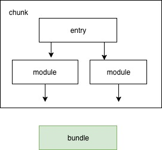

## webpack学习
本篇文章是《webpack实战》的阅读总结，书的作者是开源打包工具Ykit的主导者居玉皓，作者在构建工具开发上有着非常丰富的实战经验；
书中未涉及webpack源码的解读，主要阐述了如何利用webpack进行项目最佳构建方案的探索，所以阅读难度不大。
其实对于webpack的学习可以总结为模块，输入输出，预处理器loader，插件plugin，以及构建性能优化几个方面，所以以下我梳理的知识点也都包含在这其中。

### 模块
在模块这个概念出现之前，所有js模块都是通过scipt标签引用的方式实现，每个模块的顶层作用域都是全局作用域，在进行变量声明时会污染全局环境
而后续推陈出新的模块方案实际上都是通过形成属于模块自身的作用域来解决这个问题。
#### 常用的几中模块标准
- commnJS:

导出：
```
/* calculator.js */
module.exports = {
    add: function(a, b) { return a+b; }
}
```
导入：

```
/* index.js */
const calcuator = require('./calcuator.js')
```

- es6 module
导出：
```
/* calcuator.js */
export default function(a, b) { return a+b; }
```
导入：

```
/* index.js */
import calcuator from './caculator.js';
```
另外还有AMD.js，sea.js等不再赘述

#### 关于几种模块的差异

##### 动态与静态

commonJS采用的是静态依赖的方式，而ES6 module采用的是动态依赖，关于这两者的差异官方的解释
>"'动态'模块依赖关系的建立发生在代码运行时，而'静态'模块依赖关系的建立发生在代码编译时"

对于这个差异我的翻译是：假如把建立模块依赖比喻成将代码垒成一道墙，而各个依赖是水泥，砖头，
胶水，木头，也可能会有车床（出现车床是不是有点奇怪，高能在后方），那么动态依赖就是在建立依赖前把所有这些都堆在工地上，然后要什么取什么，而动态依赖就比较
有水平了，它事先分析了一道墙需要什么（术语就是建立依赖图chunk），取到的都是用到的，这样工地上就不会出现车床了。
##### 值拷贝与动态映射

>在导入一个模块时，对于commonJS来说获取的是导出值的拷贝，而在ES6 Module中则是动态映射；

专家们都喜欢用术语吓唬人，其实很简单
再将模块做个比喻，他现在是个人，那commonJS导入的是一个克隆人，而ES6导入的是镜子里的人。所以commonJS导入的对象是可以进行读写的，而es6 module导入的对象是只读的。
##### 循环依赖
commonJS和ES6在出现依赖循环时处理的结果也有所不同，由于commonJS在模块初次导入时会在模块系统中建立一个该模块的空对象，所以在该模块未执行完前，所有
对该模块的引用都是空对象。而es6 module会直接输出undefined，这就是这两个模块标准在处理循环依赖的本质

### 输入与输出
在流程的开始，需要指定一个入口或多个入口，如果把各个模块的依赖关系当成一棵树，那入口就是树的根，webpack会从入口文件开始检索，并将具有依赖关系的模块生成一棵依赖树
最终得到一个chunk，由这个chunk得到的打包产物称之为bundle,如下图



如下是资源输入输出的相关配置
- entry:入口文件路径，可以是字符串类型，数组类型，对象类型函数类型，函数类型，有如下几个功能的选择，选择依赖，多入口配置，根据环境生成不同配置，可以根据场景选择适合的类型
- output:输出配置，可以指定文件名（filename），输出路径(path)，另外可以根据文件生成hash值，利用hash值进行命名解除缓存

### 预处理器loader
loader本质是一个函数，可以用如下公式表达
> output = loader(input)

input可能是工程源文件的字符串，也可能是上一个loader转化后的结果，包含转化后的文件（字符串类型），source map，以及AST对象，output同样包含这几样信息

关于loader比较重要的主要是两大块，配置和实现
#### 配置
- test: 用于匹配文件，可接受一个正则表达式或者一个元素为正则表达是的数组，只有正则匹配上的模块才会使用这条规则
- use:可接受一个数组，数组包含该规则所使用的loader
- options:预处理器接收的参数，根据该参数进行不同形式的预处理
- exclude，include:文件过滤，利用正则对文件路径和文件名的匹配，这里需要注意的是exclude的优先级要高于include
- resource，issuer:在exclude和include的基础上进行更加细粒度的过滤，exclude和include实际上都是对被加载者的过滤
而对resource，issuer进行配置可以实现对加载者的过滤
- enforce：配置预处理执行时期，常用的有pre，normal和post

#### 实现一个简单的loader
原理上实际就是编写一个文件处理的函数，输入和输出都是确定的，比较简单，这里有我实现的一个在打包文件前统一加描述的简单loader
[misasm-prefix-loader](https://github.com/miracle9312/source-mock/tree/master/src/webpack/src/loaders/miasm-prefix-loader)

### 未完待续
后面还有样式处理，代码分片，生产环境配置，打包优化，开发环境调优的介绍

### 关于性能优化和一些开发技巧
以下是我整理的在日常开发中可以利用的技巧
- url-loader:对图片的加载可以利用url-loader，设置文件size阈值，在该阈值内的图片都会被打包成base64
这样可以提升图片的加载性能，之前的开发时都会在代码中写base64，会令代码难以维护；
- vendor.js:对于第三方模块的依赖可以单独打成一个vendor.js，这部分代码极少会有变动，这样在代码有更新时，就不需要
重新加载第三方依赖模块生成的代码
- npm本地开发实践：之前在对npm包代码改动时，都是在node_module中直接修改代码，然后把代码拷到npm源代码，这样做
其实非常蠢，而且容易出错，有个简单的命令在这里分享下
```
npm install <path-to-loader>/your-repo
```
这行命令可以把本地文件安装到node_module目录下，并生成一个软链，这样对于npm源代码的改动直接会在node_module目录下生效
